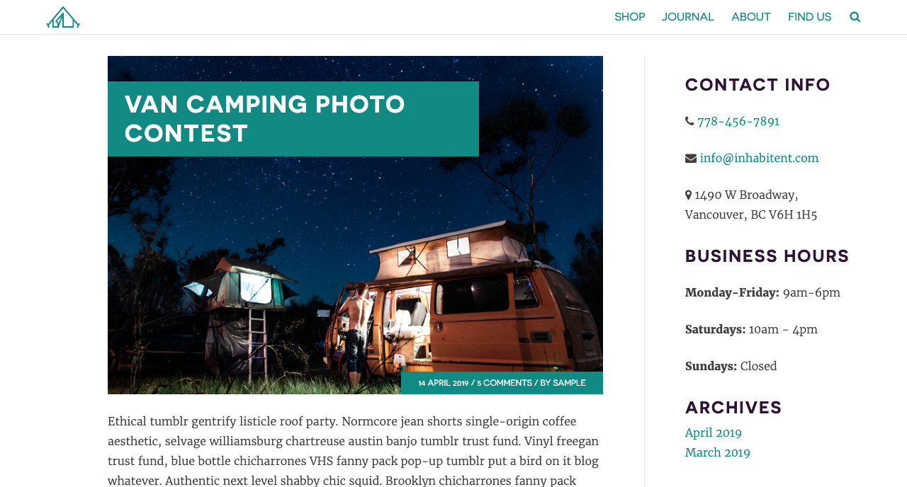
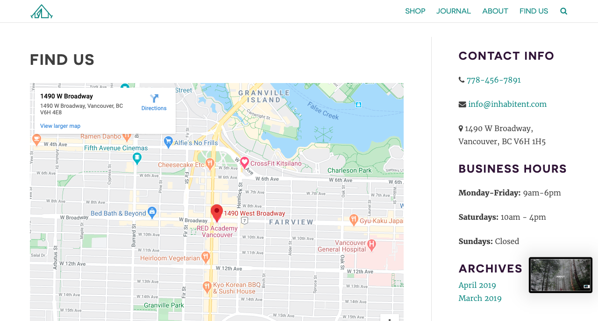

## Inhabitant
Website powered by wordpress for Inhabitant Camping Supply Co.

## Description 

Dynamic website for camping supplier. Where the client have the option to upload post related to its customers, and also, upgrade the products description, including the price, image and taxonomy.

All the company's, products and posts information are editable for the client as well as the About and Home image background. Using the user friendly interface created by wordpress. 

## Development and PlugIns

+ Download Wordpress.org
+ Create DataBase table on SQL to stored the data provided.
+ Upload Product-Functionality on the plugins to control the Products and Post objects.
+ Create the objects attributes for products and post on [GenerateWp](https://generatewp.com/taxonomy/).
+ Upload Products
+ Upload the following PlugIns:
  + [debug-bar](https://wpengine.com/solution-center/debug-bar/): Adds a debug menu to the admin bar that shows query, cache, and other helpful debugging information.
  + [wp-migrate-db](https://es.wordpress.org/plugins/wp-migrate-db/)
  + [query-monitor](https://querymonitor.com/) :It enables you to debug database queries, PHP errors, hooks and actions, block editor blocks, enqueued scripts and stylesheets, rewrite rules, HTTP API calls, and much more.
+ Create Widgets: 
  + business-info: Interface to allow the client edit the business info (Phone, address, email)  displayed on the SideBar.
  + business-hours-widget: Interface to allow the client edit the business hours  displayed on the SideBar.
+ This project was developed and stylized using Sass, NPM and JavaScript.
+ All the data provided by the user in the WordPress Interface, was got using Php functions described in the WordPress.org documentation. 

## Final Result

### Front Page

### About Page

### Post

### Contact Page

## Sources 

+ [JavaScript Objects](https://www.w3schools.com/js/js_objects.asp)
+ [NPM](https://www.npmjs.com)
+ [Wordpress Documentation](https://developer.wordpress.org/)
+ [Sass](https://sass-lang.com/)
+ [GULP](https://gulpjs.com/)
+ [JQUERY](https://jquery.com/)
+ [PHP](https://www.php.net/docs.php)
+ [GenerateWp](https://generatewp.com/taxonomy/)
